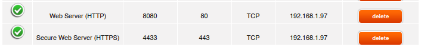
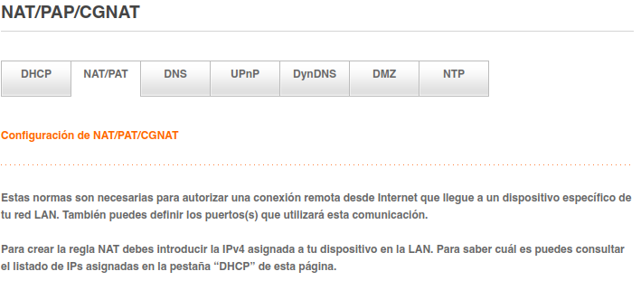
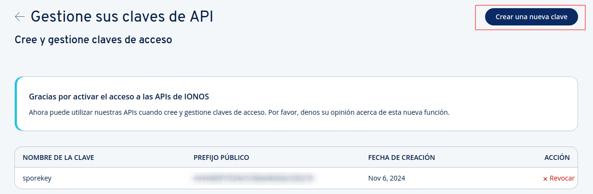
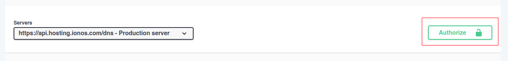
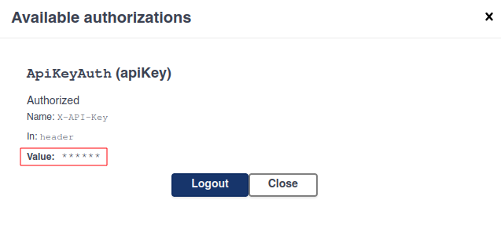
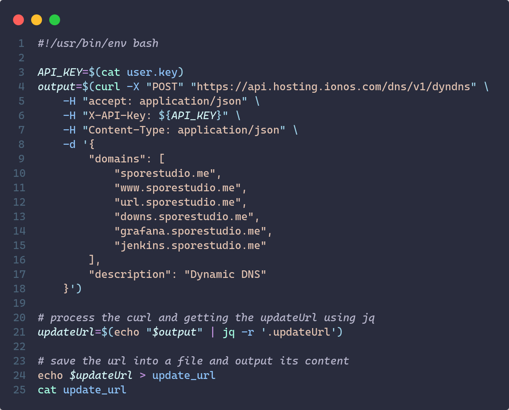
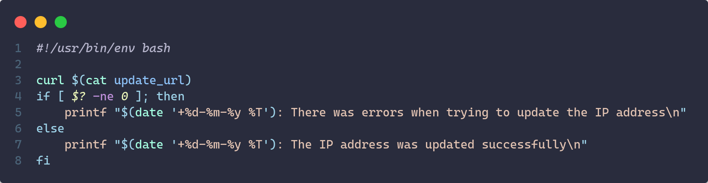
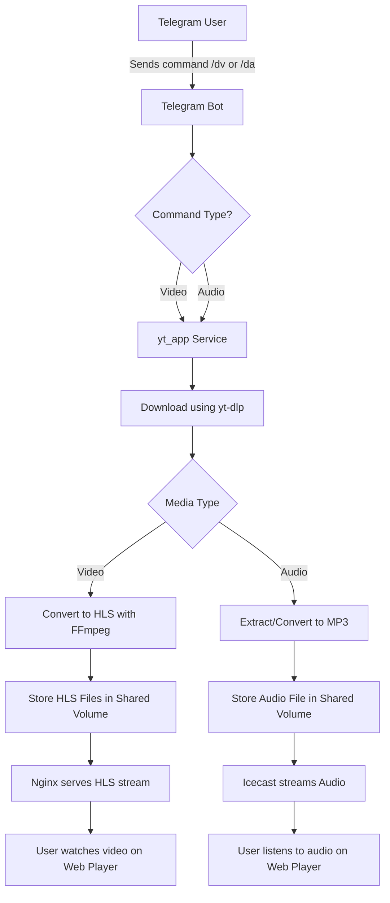
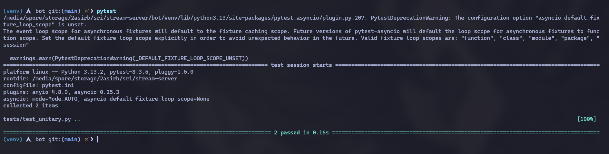
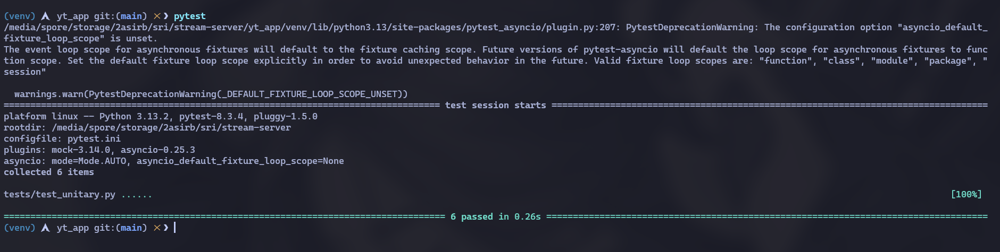

# Stream Server Documentation

Deployment of a system to automate the download and preparation of multimedia content from YouTube through a Telegram bot using Docker containers and Nginx.

## Index

- **Web Server Deployment**
    - [Previously configurations](#previously-configurations)
    - [Web Server](#wev-server-configuration)
    - [Project Workflow](#project-workflow)
    - [Tests](#tests)
    - [License](#license)
    - [Contribute](#contribute)
    - [Author](#author)

## Previously configurations

### Router configurations

In this project the server will be my personal computer, which does not have a public IP, so we must map port 80 of our router with port 8080 of our machine, as well as port 443 with port 4433 of localhos to allow HTTPs traffic.

<div align="center">
    
</div>

We have to login in the router and go to the *NAT/PAD* that is usually where we can open ports (at least in Orange routers)

<div align="center">
    
</div>

#### Dynamic DNS 

As we do not have a static IP configured in our router, but we have a dynamic IP that changes from time to time, we will need a dynamic DNS service for our domain to point to our IP even though it may change.
In this case, I have purchased the domain from IONOS, so **this documentation is based on the steps to follow to configure the dynamic DNS service with IONOS as the provider**.

The first thing we have to do is to generate an API KEY to be able to interact with the IONOS service. To do this we have to visit the web: https://developer.hosting.ionos.es/?source=IonosControlPanel, go to the IONOS developer section and here we will find an option called manage keys.

<div align="center">
    
</div>

Once we have our API Key we have to go the [DNS documentation section](https://developer.hosting.ionos.es/docs/dns) and authorize the service with our API Key.

<div align="center">
    
</div>


<div align="center">
    
</div>

We must make a POST request with our API Key and our domains and we will receive the url in JSON format.

```json
{
  "bulkId": "e0d3db69-19cc-449a-aca0-7fb4b69ba774",
  "updateUrl": "https://ipv4.api.hosting.ionos.com/dns/v1/dyndns?q=YTFmN2Q5Y2VkYmQ0NDE2OWJlZDEwNDBiZDRlNTFlNTkuUTNPaWJTaG1rMnBpUVVoMUhlcDdlVWpyZ2Mxb0J0MEdsbHZrSWF6dzVlTURZMjZON2VtUlFKS1k2SFhfeEVMaEs1Y1cyRjJvV1NhcUhTajVUNVlSYlE",
  "domains": [
    "stream.sporestudio.me"
  ],
  "description": "My DynamicDns"
}
```

>[!NOTE]
> We can obtain the update url automatically executing the geturl.sh script, you just change the fields of the API Key with your code and change my domains to yours.

<div align="center">
    
</div>

To make sure that the IP is always update we encapsulated this service in a docker container that is running cron updating the IP address every minute. We've created an image using the official Docker's Debian image where we copy the script `update.sh` to the container and a crontab will be running the script every minute.

<div align="center">
    
</div>

This script will be running in our Docker container as a service, so we've created a docker image for it.

```Dockerfile
FROM debian:12.8
RUN apt-get update && apt-get -y install cron curl

WORKDIR /app

COPY update.sh update.sh
COPY update_url update_url
RUN chmod +x update.sh

COPY cronjob /etc/cron.d/cronjob
RUN chmod 0644 /etc/cron.d/cronjob
RUN crontab /etc/cron.d/cronjob

CMD ["cron", "-f", "/etc/cron.d/cronjob"]
```

### Install dependencies for the project

Before deploy the project we have to install the necessary dependencies for our apps.

#### Install bot dependencies

We have to navigate to the app directory and create a virtual enviroment (optional but recommended).

```bash
$ cd bot/
$ python -m venv venv
$ source venv/bin/activate
```

Now install dependencies with `pip install`.

```bash
$ pip install -r requirements.txt
```


#### Install youtube downloader dependencies

The steps to install the dependencies of youtube downloader will be the same, we have to navigate to yt_app directory and install the dependencies with `pip install`.

```bash
$ cd yt_app/
$ python -m venv venv
$ source venv/bin/activate
$ pip install -r requirements.txt
```

### Create .env file

You will need to create a `.env` file with the following fields for the project to work.

```bash
## Telegram bot API Token
TELEGRAM_TOKEN=

# IONOS API Token
IONOS_TOKEN=

## Apache global vars
DOMAIN_NAME=
SERVER_ADMIN=
```

>[!CAUTION]
> Never commit sensitive values to control version.


## Web server configuration

### Obtain the SSL certificates via Cerbot

In order to provide a safe and encrypted connection to our server, we will need a valid certificate. We will do using [certbot](https://hub.docker.com/r/certbot/certbot) which is a docker image provide by [**Let's Encrypt**](https://letsencrypt.org/es/), an open and free certificate authority.

Cetbot uses the ACME (Automatic Certificate Management Enviroment)  protocol, provided by Let's Encrypt to obtain and renewing the SSL certificates.

#### How Certbot and ACME work together

1. **Domain Ownership Validation**:
    - Certbot proves to the Let's Encrypt Certificate Authority (CA) that you control the domain for which you are requesting an SSL certificate.

    - The ACME protocol facilitates this validation process.

2. **Validation method**: Certbot uses severals methods to complete domain validation, in our case, we're going to explain the HTTP-01 Challenge that is what we used in this project, to more info about the other methods you can check the [certbot official documentation](https://eff-certbot.readthedocs.io/en/stable/).

    - **HTTP-01 Challenge**: Is a method used by Certbot and other ACME clients to validate domain ownership for *SSL/TLS* certificate issuance. It works by creating a unique token and placing it in a specific file (`/.well-known/acme-challenge/*TOKEN*`) on your server. 
    
        The Certificate Authority (CA), such as Let's Encrypt, then makes an HTTP request to retrieve this file and confirm its contents. If the file is correctly served, the CA verifies that you control the domain and issues the certificate. This method requires the domain to be publicly accessible via HTTP (port 80) but is simple to automate, making it ideal for many web servers.

3. **Certificate Issuance**:
    - Once ownership is confirmed, Let's Encrypt issues an *SSL/TLS* certificate for your domain.

    - Certbot downloads and configures this certificate, usually placing the files in `/etc/letsencrypt/live/<yourdomain>/`.

4. **Automatic Renewal**:
    - Certificates from Let's Encrypt are valid for 90 days.

    - Certbot includes a built-in renewal mechanism *(certbot renew)*, which ensures your certificates remain valid without manual intervention.

So in this project to obtain the SSL certificates I've created a temporary web server listening on port 80 with the domain we want to certificate, and once the server is listening on port 80, we will run the certbot container to obtain the certificates:

<div align="center">
    
</div>

> [!NOTE]
> The certificates will be created on the container's directory `/etc/letsencrypt`, so we created a permanent docker volume called **certs** to preserve it.

## Project Workflow

The project is composed of several integrated components that work together to enable live streaming from YouTube downloads. The overall workflow is as follows:

- **1. User Interaction via Telegram Bot**:
  Users send commands such as /dv (video) or /da (audio) to the Telegram Bot.

- **2. Request Processing**:
    The Telegram Bot receives the command and forwards the request (with the YouTube URL and the media type) to the conversion service (yt_app).

- **3. Downloading and Conversion**:
    The yt_app service uses yt-dlp to download the requested media. Depending on the media type:
    For video streaming, the video is downloaded and converted to HLS format using FFmpeg.
    For audio streaming, the audio is extracted (and possibly converted) to a streaming-friendly format (e.g., MP3).

    > *The output files are saved in a shared volume*.

- **4. Streaming Setup**:
    Video: Nginx serves the HLS files (playlist .m3u8 and segments .ts) to end users.
    Audio: Icecast (or a client like ices2) streams the audio, and Nginx can proxy the stream if needed.

- **5. User Playback**:
    The end-user accesses the web interface where they can select a video or audio stream to watch or listen to.




## Tests

We have created some tests that guarantee the performance and uniformity of the application code. For this I have used the Pytest library that allows you to create tests for your application easily in a few lines of code.

### Bot unitary test

Complementing these, the Bot Integration Tests (in bot/tests/) focus on the bot's interaction with the API. These tests simulate real-world API communication patterns, verifying successful parsing of JSON responses into usable file paths and metadata during valid requests. They rigorously assess error recovery mechanisms by mocking HTTP error responses (e.g., 404 Not Found) and network failures, ensuring the bot handles these scenarios without crashing. Asynchronous operation validation is a key focus, confirming the bot's non-blocking HTTP client correctly manages concurrent requests.

#### Verify API successfull response

```python
#!/usr/bin/env python3
# -*- coding: utf-8 -*-

import pytest
import httpx
from bot.utils.downloader import download_media
from anyio import create_task_group, run

@pytest.mark.asyncio
async def test_download_media_success(monkeypatch):
    class DummyResponse:
        status_code = 200

        def json(self):
            return {"filename": "dummy.mp4", "title": "Dummy Title"}

        @property
        def text(self):
            return "dummy response"

    async def dummy_post(*args, **kwargs):
        return DummyResponse()

    class DummyClient:
        async def __aenter__(self):
            return self

        async def __aexit__(self, exc_type, exc, tb):
            pass

        async def post(self, *args, **kwargs):
            return await dummy_post(*args, **kwargs)

    monkeypatch.setattr(httpx, "AsyncClient", lambda timeout: DummyClient())

    result = await download_media("https://www.youtube.com/watch?v=dummy", "video")
    assert result is not None
    assert result["path"] == "/shared/dummy.mp4"
    assert result["title"] == "Dummy Title"
```

#### Verify API failure response


```python
@pytest.mark.asyncio
async def test_download_media_failure(monkeypatch):
    class DummyResponse:
        status_code = 404

        @property
        def text(self):
            return "Not Found"

    async def dummy_post(*args, **kwargs):
        return DummyResponse()

    class DummyClient:
        async def __aenter__(self):
            return self

        async def __aexit__(self, exc_type, exc, tb):
            pass

        async def post(self, *args, **kwargs):
            return await dummy_post(*args, **kwargs)

    monkeypatch.setattr(httpx, "AsyncClient", lambda timeout: DummyClient())

    result = await download_media("https://www.youtube.com/watch?v=dummy", "video")
    assert result is None
```

#### How to run the tests

1. Ensure that all dependencies are installed. Navigate to url-shortener directory, create a virtual enviroment and activate it (optional but recommended).

```bash
$ cd bot/
$ pyhton3 -m venv venv
$ source venv/bin/activate
```

2. Then install the dependencies from the `requirements.txt` with pip.

```bash
$ pip install -r requirements.txt
```

3. Run the tests.

```bash
$ pytest
```

<div align="center">
    
</div>


### Youtube downloader unitary test

The Video Download API Tests (located in yt_app/tests/) rigorously validate the core functionality of the /api/download endpoint. These tests verify proper input validation by checking for missing or malformed parameters, ensuring the API returns appropriate HTTP status codes (400 for client errors, 500 for server-side issues). They mock the YouTubeDL integration to simulate metadata extraction and download processes, confirming correct filename generation using slugified titles and timestamps to prevent naming collisions. The tests also validate format selection logic, ensuring video requests prioritize bestvideo+bestaudio while audio requests use bestaudio. Error handling is thoroughly tested to guarantee graceful failure recovery during invalid URL submissions or unexpected download interruptions.

#### Input validation test

```python
#!/usr/bin/env python3
# -*- coding: utf-8 -*-

import pytest
from unittest.mock import Mock, patch
from yt_app.main import app

@pytest.fixture
def client():
    app.config['TESTING'] = True
    with app.test_client() as client:
        yield client

def test_missing_url(client):
    response = client.post('/api/download', json={'type': 'video'})
    assert response.status_code == 400
    assert 'error' in response.json
```

#### Integration with YoutubeDL

```python
@patch('yt_app.main.YoutubeDL')
@patch('yt_app.main.datetime')
def test_successful_video_download(mock_datetime, mock_ydl, client):
    mock_datetime.now.return_value.strftime.return_value = '2024-01-01_12-00-00'
    mock_info = {'title': 'Test Video', 'ext': 'mp4'}
    
    mock_instance = Mock()
    mock_instance.extract_info.return_value = mock_info
    mock_instance.prepare_filename.return_value = '/shared/test_video-2024-01-01_12-00-00.mp4'
    mock_ydl.return_value.__enter__.return_value = mock_instance

    response = client.post('/api/download', json={
        'url': 'https://youtube.com/watch?v=abc123',
        'type': 'video'
    })
    
    assert response.status_code == 200
    assert 'test_video-2024-01-01_12-00-00.mp4' in response.json['filename']

@patch('yt_app.main.YoutubeDL')
def test_audio_download_format(mock_ydl, client):
    
    mock_instance = Mock()
    mock_instance.extract_info.return_value = {'title': 'Test Audio', 'ext': 'mp3'}
    mock_instance.prepare_filename.return_value = "/shared/test_audio.mp3"  
    mock_ydl.return_value.__enter__.return_value = mock_instance

    
    response = client.post('/api/download', json={
        'url': 'valid_url',
        'type': 'audio'
    })
    
    
    ydl_opts = mock_ydl.call_args[0][0]
    assert ydl_opts['format'] == 'bestaudio'
    assert response.json['filename'] == 'test_audio.mp3' 
```

#### Error handling test

```python
@pytest.mark.asyncio
async def test_download_media_failure(monkeypatch):
    class DummyResponse:
        status_code = 404

        @property
        def text(self):
            return "Not Found"

    async def dummy_post(*args, **kwargs):
        return DummyResponse()

    class DummyClient:
        async def __aenter__(self):
            return self

        async def __aexit__(self, exc_type, exc, tb):
            pass

        async def post(self, *args, **kwargs):
            return await dummy_post(*args, **kwargs)

    monkeypatch.setattr(httpx, "AsyncClient", lambda timeout: DummyClient())

    result = await download_media("https://www.youtube.com/watch?v=dummy", "video")
    assert result is None
```

#### How to run the tests

1. Ensure that all dependencies are installed. Navigate to url-shortener directory, create a virtual enviroment and activate it (optional but recommended).

```bash
$ cd yt_app/
$ pyhton3 -m venv venv
$ source venv/bin/activate
```

2. Then install the dependencies from the `requirements.txt` with pip.

```bash
$ pip install -r requirements.txt
```

3. Run the tests.

```bash
$ pytest
```

<div align="center">
    
</div>


## License

This project is licensed under the GNU General Public License - see the [LICENSE](https://github.com/sporestudio/stream-server/blob/main/LICENSE) file for details.

## Contributing

Want to contribute? There are multiple ways you can contribute to this project. Here are some ideas:

* [Translate the web into multiple languages!](/docs/CONTRIBUTING.md#translations)
* [Reporting Bugs](/docs/CONTRIBUTING.md#reporting-bugs) 
* [Check out some issues](https://github.com/sporestudio/stream-server/issues) (or translate them).

## Author

This repository was created by [sporestudio](https://github.com/sporestudio).